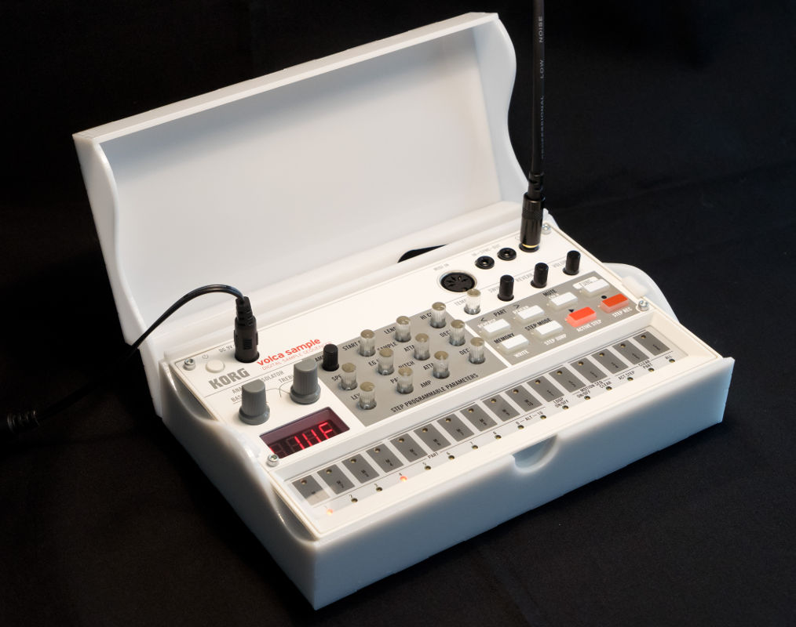
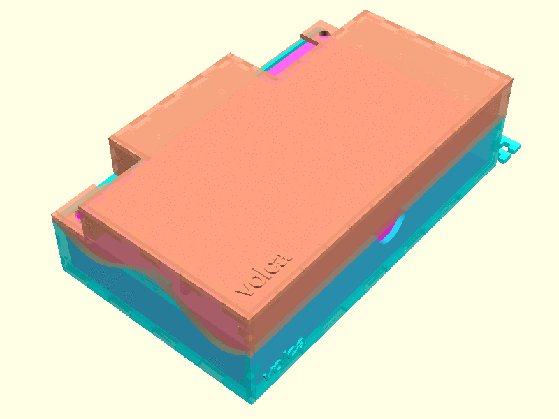
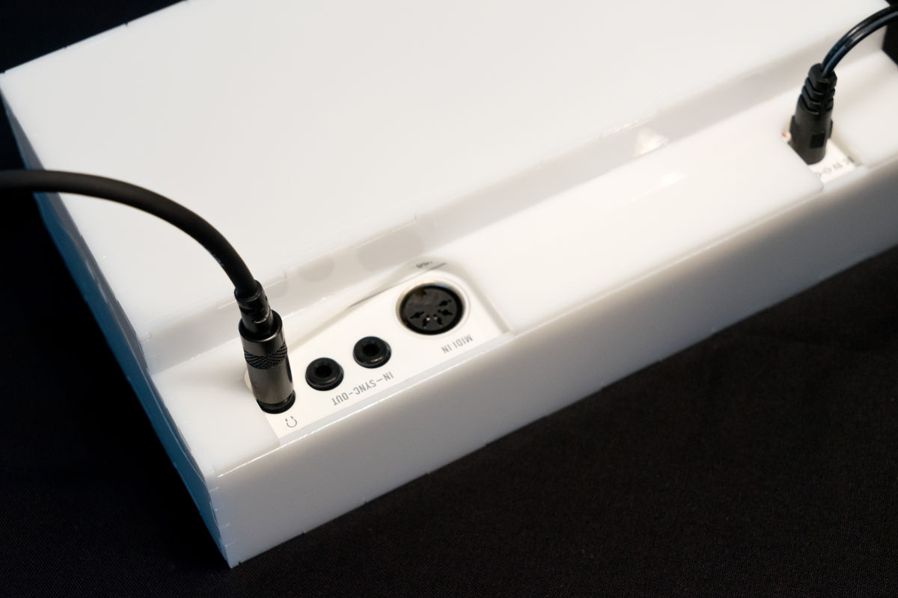

# Volca Case
Transport case and dust protector for all Korg Volca synthesizers, made with OpenSCAD.

The lid can be removed without unplugging any cables.

## How to build one
Download pre-made 2D templates [from the releases page](https://github.com/mbugert/volca-case/releases) or customize and create your own template (see below). Then, feed the template to a lasercutter and assemble the case using some glue.
If you don't know where to lasercut, check the internet to find a nearby FabLab/Makerspace which owns a lasercutter.

## How to customize
Multiple things about the case can be customized, such as:
* case thickness
* laser kerf compensation
* larger cutouts to accomodate space for bulky plugs
* disabling cutouts in the lid altogether

The case is made with OpenSCAD. You will need to install:
* [OpenSCAD](http://www.openscad.org/)
* the [lasercut](https://github.com/bmsleight/lasercut) library
* the (**linux only!**) [laserscad](https://github.com/mbugert/laserscad/) library

Once these are set up, you can customize the case by changing stuff in ``src/modules/case_settings.scad``. Then, follow the instructions at "Exporting to 2D" in the [laserscad readme](https://github.com/mbugert/laserscad/blob/master/README.md) to create your 2D template.

Alternatively, to export the case for all Volca units and materials of various thicknesses, additionally install ``imagemagick`` and follow the instructions in ``make-case``.